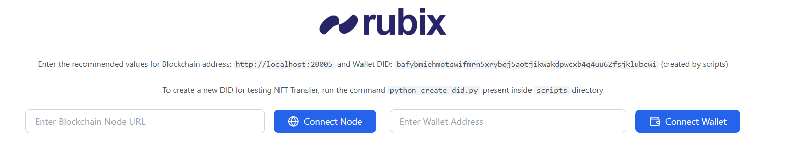
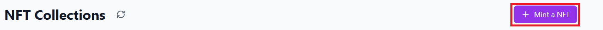
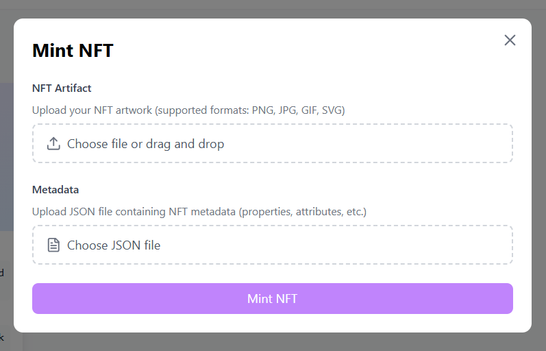
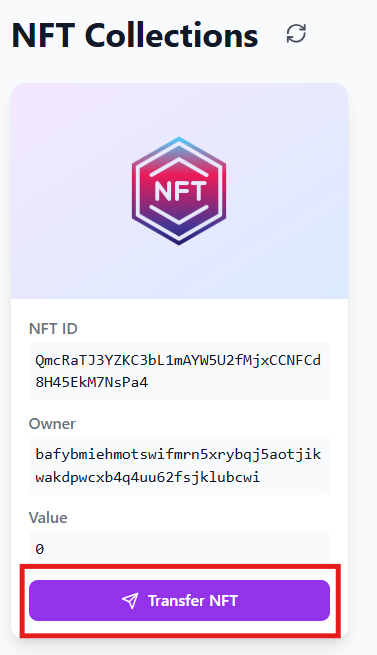
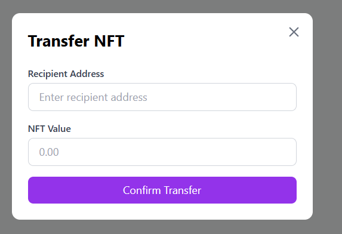

# Rubix NFT App

A simple application to showcase operations related to Rubix's native NFT and utilizing WASM based smart contract to achieve them.

## Prerequisites

- Node & NPM
- Python
- Golang
- tmux (For MacOS and Linux users)

## Instructions

### 1. Run a Localnet

1. Move inside the `scripts` dir
  ```
  cd scripts
  ```

2. Run the localnet script

  ```
  python3 run.py
  ```

A total of 5 Quorum and 1 Non-Quorum nodes will run. Quorum nodes will run on ports between 20000 to 20004, while the non-quorum node will run on port 20005. A DID will already created for use and it will be visible on the Dapp's UI. It also deploys the NFT smart contract.

3. To shutdown all nodes

```
python3 shutdown.py
```

### 2. Run CallBack DApp Server

A Callback DApp server expects a request from a Rubix Node where a Smart Contract is executed. To run this server:

```
cd backend/dapp_server
go run .
```

It will run on port 8080.

### 3. Run Frontend Server

The Frontend is written in React + Typescript with Vite build tooling. We need to run two servers here: Vite server and File Server which hosts NFT artifact and metadata files

1. Install Dependencies

```
npm i
```

2. Run the Vite server

```
npm run dev
```

3. In another terminal, run the File Server

```
node server.js
```

The App will hosted on port `5173`, and the file server runs on `3000`

## Usage

- Connect the DApp by adding the non quorum node's address and a DID as mentioned in the message:



- Click the "Mint a NFT" button to mint an NFT



- A window will appear asking for two files:



`NFT Artifact` - It represents a file which is meant to be an NFT. Even though there is no restriction on file extensions, this DApp is only restricted to images for now

`Metadata` - Its a JSON document containing information about the NFT.

Click the "Mint NFT" button and wait for the transaction to complete. If the transactions is success, the NFT will be shown in the DApp homepage. A freshly minted NFT has value of 0 RBT

- To transfer an NFT, click the `Transfer NFT` button on the NFT you wish to transfer.



- Enter the recipient DID and the RBT value at which you want to transfer this NFT. You can run the script `create_did.py` to create a DID which will be preloaded with 70 test RBT tokens.



- After the transfer is successful, change the DID which is currently connected the DApp by clicking the "Connected" button, and you will see the NFT is now in possession of the recipient DID